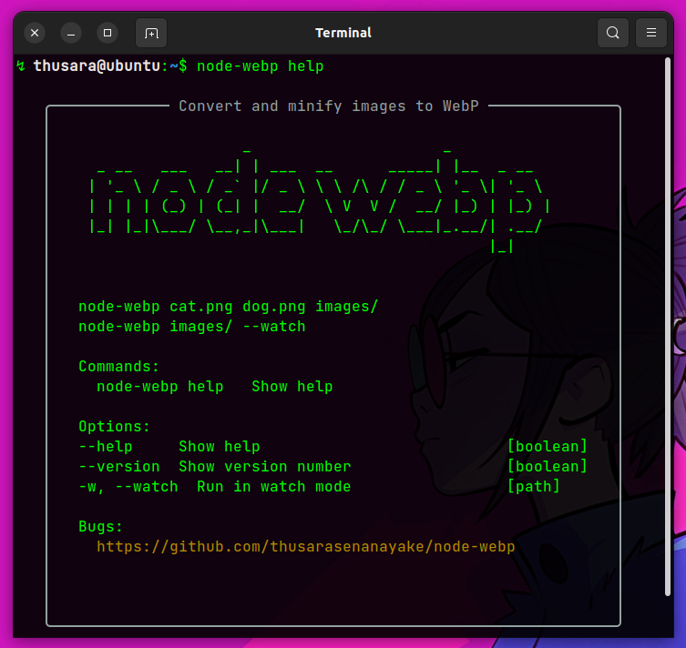

### ABOUT

node-webp is a command-line utility that allows you to convert and minimize images into the WebP format.

### SCREENSHOTS



### INSTALLATION

```sh
# to install globally
npm install -g .

# to create a symlink in the global package folder
npm link

```

### CONTRIBUTING

Contributions to **node-webp** are welcome! If you encounter any issues, have suggestions, or want to contribute code improvements, please visit the [GitHub repository](https://github.com/thusarasenanayake/node-wepp) and create a new issue or pull request.

### LICENSE

This project is licensed under the MIT License. See the [LICENSE](LICENSE) file for details.

### ACKNOWLEDGMENTS

**node-webp** uses the following open-source dependencies:

- [boxen](https://www.npmjs.com/package/boxen) (version 5.1.2)
- [chalk](https://www.npmjs.com/package/chalk) (version 4.1.2)
- [figlet](https://www.npmjs.com/package/figlet) (version 1.6.0)
- [gulp](https://www.npmjs.com/package/gulp) (version 4.0.2)
- [gulp-imagemin](https://www.npmjs.com/package/gulp-imagemin) (version 7.1.0)
- [gulp-webp](https://www.npmjs.com/package/gulp-webp) (version 4.0.1)
- [yargs](https://www.npmjs.com/package/yargs) (version 17.7.2)
